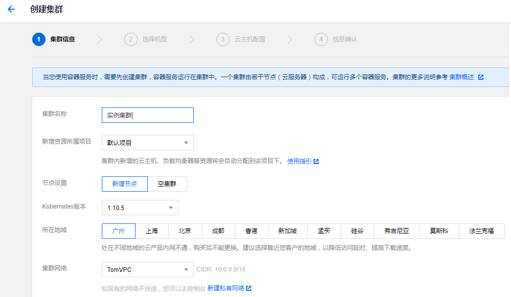

# <a name="tutorial-deploy-an-tke-kubernetes-service-aks-cluster"></a> 部署腾讯容器服务 (TKE) 群集

Kubernetes 为容器化应用程序提供一个分布式平台。 使用 TKE 可以快速预配生产就绪的 Kubernetes 群集。  本节在 TKE 中部署了 Kubernetes 群集。 学习如何：

> [!div class="checklist"]
> * 创建用于资源交互的服务主体
> * 部署一个 Kubernetes TKE 群集
> * 安装 Kubernetes CLI (kubectl)
> * 配置 kubectl，以便连接到 TKE 群集

在后续教程中，腾讯云投票应用程序将部署到群集，并进行缩放和更新。

## <a name="before-you-begin"></a>开始之前

在以前的教程中，已创建容器映像并上传到 腾讯云 Tencent Hub 容器仓库。 如果尚未完成这些步骤，并且想要逐一完成，请返回到 上节创建容器映像

 
## <a name="create-a-kubernetes-cluster"></a>创建 Kubernetes 群集

创建集群
1. 登录 [腾讯云容器服务控制台](https://console.cloud.tencent.com/ccs) 。
2. 单击左侧导航栏中的 集群，单击集群列表页的 【新建】。


3. 设置集群的基本信息。

 +  集群名称：要创建的集群的名称。不超过60个字符。
 +  计费模式：提供包年包月和按量计费两种计费模式，详细对比请查看 [计费模式说明](https://cloud.tencent.com/doc/product/213/2180)。
 +  所在地域：建议您根据所在地理位置选择靠近的地域。可降低访问延迟，提高下载速度。
 +  可用区：同地域内，内网互通；不同地域，内网不通。需要多个内网通信的用户须选择相同的地域。
 +  节点网络：为集群内主机分配在节点网络地址范围内的 IP 地址。参阅 [容器及节点网络设置](https://cloud.tencent.com/doc/product/457/9083)。
 +  容器网络：为集群内容器分配在容器网络地址范围内的 IP 地址。参阅 [容器及节点网络设置](https://cloud.tencent.com/doc/product/457/9083)。
 +  集群描述：创建集群的相关信息。该信息将显示在 集群信息 页面。



4. 选择机型 (支持系统盘为云盘的所有机型)。

 + 系列：提供 系列 1 和 系列 2 。详细对比参看 [实例类型概述](https://cloud.tencent.com/doc/product/213/7153#.E5.8F.AF.E7.94.A8.E5.AE.9E.E4.BE.8B.E7.B1.BB.E5.9E.8B2) 。
 + 机型：机型选择方案参看 [确定云服务器配置方案](https://cloud.tencent.com/doc/product/213/2764#.E7.A1.AE.E5.AE.9A.E4.BA.91.E6.9C.8D.E5.8A.A1.E5.99.A8.E9.85.8D.E7.BD.AE.E6.96.B9.E6.A1.88)。


5. 填写云主机配置。

 + 系统盘：固定为 50G 。
 + 数据盘：步长 10G ，最高为 4000G 。
 + 公网宽带：提供两种计费模式，详细对比参看 购买网络带宽。
 + 带宽：勾选 免费分配公网 IP ，系统将免费分配公网 IP ，若不需要，请选择带宽值为 0 。
 + 登录方式：提供三种对应登录方式。
  i. 设置密码：请根据提示设置对应密码。
  ii.立即关联密钥：密钥对是通过一种算法生成的一对参数，是一种比常规密码更安全的登录云服务器的方式。详细参阅 SSH 密钥 。
  iii.自动生成密码：自动生成的密码将通过站内信发送给您。
 + 安全组：安全组具有防火墙的功能，用于设置云主机 CVM 的网络访问控制。参阅 容器服务安全组设置 。
 + 云主机数量：选择服务器数量。


6. 创建完成的集群将出现在集群列表中。

## <a name="connect-to-cluster-using-kubectl"></a>使用 kubectl 连接到群集

通过 Kubernetes 命令行工具 kubectl 从本地客户端机器连接到 TKE 集群. 详细安装过程参考 [Installing and Setting up kubectl](https://kubernetes.io/docs/user-guide/prereqs/)。

我们主要使用Windows 10 操作系统上来完成操作。下载kubectl 工具保存到我们的工作区，比如我的工作区是D:\workshop\Software\k8s。
https://storage.googleapis.com/kubernetes-release/release/v1.8.13/bin/windows/amd64/kubectl.exe

获取集群账号密码以及证书信息
1. 登录 [容器服务控制台 > 集群](https://console.cloud.tencent.com/ccs)，单击需要连接的集群 ID/名称，查看集群详情。

2. 在集群信息页，单击【显示凭证】，查看用户名、密码和证书信息。

3. 复制或下载证书文件到本地。

4. 获取访问入口。 开启公网访问地址后可参考  

通过证书信息使用 kubectl 操作集群,修改 kubectl 配置文件，长期有效。该方法适用于长期通过 kubectl 操作集群， 一次配置，只要文件不修改就长期有效。
设置 kubectl 配置，修改以下命令中的密码、证书信息。

```
kubectl config set-credentials default-admin --username=admin --password=xxxxxxxxxxx 记得把这里的用户名和密码换成集群的用户名和密码
```
kubectl 把配置信息存放在C:\Users\geffzhang\.kube\ 下，记得把证书放到这个目录下
继续运行以下命令
```
kubectl config set-cluster default-cluster --server=https://cls-386w5vjo.ccs.tencent-cloud.com --certificate-authority=C:\Users\geffzhang\.kube\cluster-ca.crt
kubectl config set-context default-system --cluster=default-cluster --user=default-admin
kubectl config use-context default-system
```
配置完成，直接使用 kubectl 命令：

$ kubectl get nodes

```
NAME           STATUS    ROLES     AGE       VERSION
192.168.0.11   Ready     <none>    3d        v1.10.5-qcloud-rev1
192.168.0.12   Ready     <none>    12d       v1.10.5-qcloud-rev1
192.168.0.8    Ready     <none>    12d       v1.10.5-qcloud-rev1
```

## <a name="next-steps"></a>后续步骤

本教程在 AKS 中部署了一个 Kubernetes 群集并将 `kubectl` 配置为连接到该群集。 你已了解如何：


请继续学习下一教程，了解如何将应用程序部署到群集。

<!-- LINKS - external -->
[kubectl]: https://kubernetes.io/docs/user-guide/kubectl/
[kubectl-get]: https://kubernetes.io/docs/reference/generated/kubectl/kubectl-commands#get