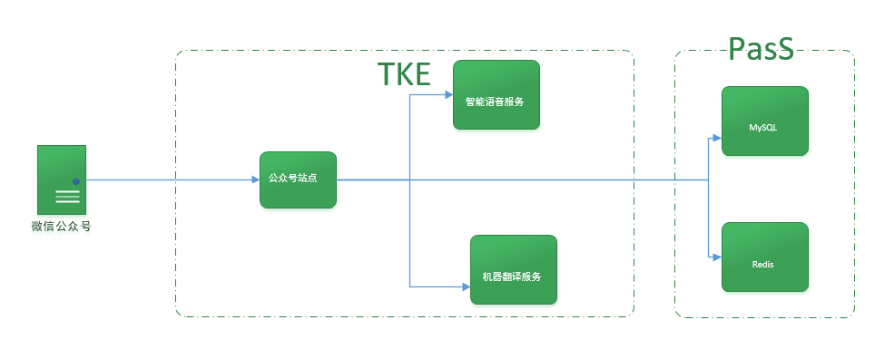
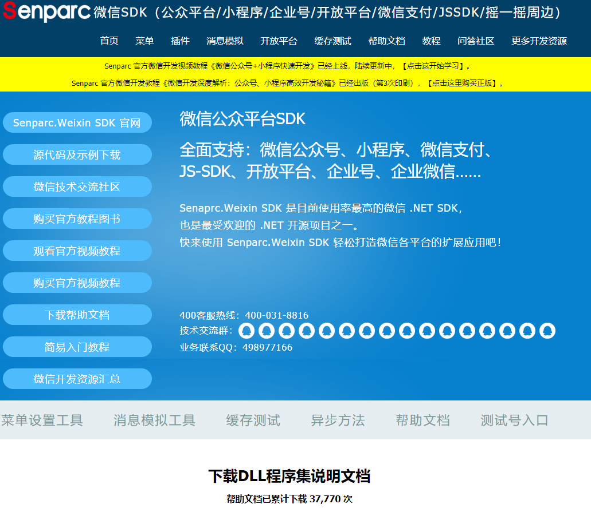
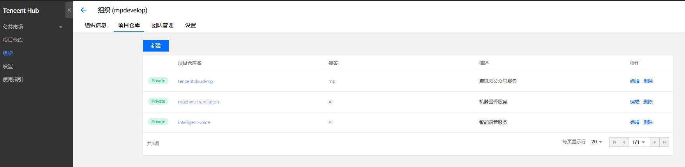
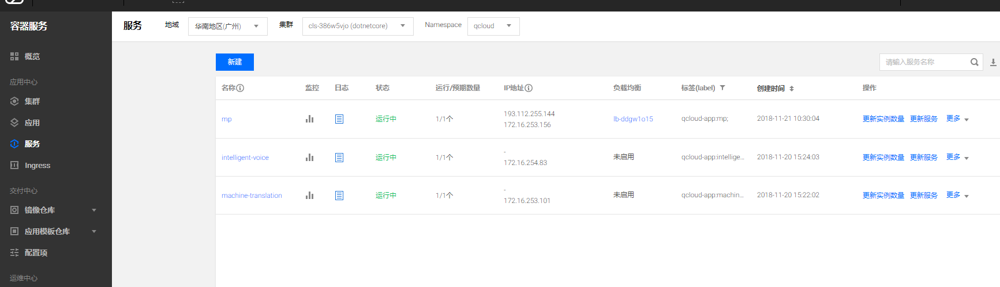

## 一、实验概述
将通过实战“微信公众号”开发，教你如何借助腾讯云的SDK让公众号更智能，以及借助腾讯云的容器服务，解决用户开发、测试及运维过程的环境一致性问题，帮助用户降低成本，提高效率。

## 二、准备工作
1、	已申请公众号账号或个人微信公众平台接口测试帐号
2、	已注册腾讯云账号
](./resource/dd.png)、 购买一个Mysql 服务 和一个 Redis服务
4、 开通Tencent Hub 服务
5、 开通腾讯云容器服务
6、	下载微信公众号Demo代码 https://github.com/geffzhang/TencentCloudMPSample 

## 三、实验架构


+ 使用腾讯云容器服务TKE 来托管我们的公众号服务
+ 公众号服务使用了腾讯云的4 个PasS服务：机器翻译、智能语音、MySQL以及Redis 服务
+ 公众号使用的机器翻译和智能语音服务进行单独的封装成2个微服务

## 四、任务一：使用 Senparc.Weixin 接入微信公众号开发

### 微信公众号SDK Senparc.Weixin.MP
Senparc.Weixin SDK 是由盛派网络（Senparc）团队自主研发的针对微信各模块的开发套件（C# SDK），已全面支持微信公众号、小程序、微信支付、企业号、开放平台、JSSDK、摇一摇周边等模块。快使用 Senparc.Weixin SDK 轻松打造微信各平台的扩展应用吧。
有详细的文档：https://sdk.weixin.senparc.com/Document ，还有客服支持以及QQ/微信支持群。
 
Github开源代码：[https://github.com/JeffreySu/WeiXinMPSDK](https://github.com/JeffreySu/WeiXinMPSDK)

### 申请微信公众号授权
先申请微信公众号的授权，找到或配置几个关键的信息（开发者ID、开发者密码、IP白名单、令牌和消息加解密密钥等）

开发者ID：固定的；
开发者密码：自己扫一下就可以看到；
IP白名单：设置自己配置服务器的地址；
服务器地址（URL）：稍后详解；
令牌：随便写，按规则；
消息加解密密钥：随便写，或者随机生成；

在微信公众平台认证之前，我们可以先申请一个测试的公众号来进行测试，这对开发人员来说还是有很大好处的。(https://mp.weixin.qq.com/debug/cgi-bin/sandbox?t=sandbox/login )


### 配置服务器地址（URL）
服务器地址（URL）应该怎么配置呢？它对应的ASP.NET Core控制器应该是怎么样子的呢?

首先我们创建一个ASP.NET Core的项目，启用docker支持。添加Nuget 包 Senparc.Weixin.MP.MVC。

在这里我们要引用.NET社区使用最广泛的微信开发SDK Senparc.Weixin。 这个SDK 也是一位MVP 领导的开源项目，他的公司叫做盛派网络。盛派网络团队最近开发了一个微信 Sample 项目生成器：WeChatSampleBuilder，帮助大家自动生成你所需的项目代码，包括任意选择.NET版本、所需使用到的微信模块、分布式缓存，等等。
我们就借助WeChatSampleBuilder 来生成微信公众号代码，我们需要启用Redis 缓存。
 
生成的示例代码中，我们把微信处理消息的代码拷到我们的项目中。


### 请求处理
在上面的处理请求信息的代码中，我自定义了一个类 CustomMessageHandler 来处理消息。
CustomMessageHandler 类继承了 MessageHandler 类，然后重写了 DefaultResponseMessage() 方法，返回固定的文本值。base.CreateResponseMessage<T>() 方法可以返回多种不同类型的结果值，如：

ResponseMessageText - 对应文本消息
ResponseMessageNews - 对应图文消息
ResponseMessageMusic - 对应音乐消息
ResponseMessageXXX - 其他类型以此类推

上述方法只是一种默认的消息处理，我们也可以专门针对不同的请求类型做出不同的回应，比如重写 OnTextRequest()，其它重载需要自己观察基类成员：

因为在继承 MessageHandler<T> 类的同时，我创建了一个 CustomMessageContext 自定义消息上下文的类，该类内容如下，并没有包含其它方法，直接继承 MessageContext<IRequestMessageBase, IResponseMessageBase> 即可：

### 记录交互请求
使用EF Core + Mysql记录交互请求。
1.Nuget 添加Microsoft.EntityFrameworkCore 与Pomelo.EntityFrameworkCore.MySql包.

2.添加实体 WeixinInteraction.cs 

```
   public class WeixinInteraction
    {
        [Key]
        public int Id { get; set; }

        public string Request { get; set; }

        public string Response { get; set; }
    }
```

3.添加TencentCloudDbContext.cs继承EF的DBContext类。 

```
namespace TencentCloudMPSample.EFCore
{
    public class TencentCloudDbContext : DbContext
    {
        public TencentCloudDbContext(DbContextOptions<TencentCloudDbContext> options):base(options)
        {
        }

        public DbSet<WeixinInteraction> WeixinInteractions { get; set; }

        protected override void OnModelCreating(ModelBuilder modelBuilder)
        {
            base.OnModelCreating(modelBuilder);
        }
    }
}
```

4.添加数据库操作类WeixinInteractionServer.cs 
```
namespace TencentCloudMPSample.EFCore.Servers
{
    public class WeixinInteractionServer
    {
        private TencentCloudDbContext _dbContext;

        public WeixinInteractionServer(TencentCloudDbContext dbContext)
        {
            _dbContext = dbContext;
        }

        public async Task AddInteraction(string request,string response)
        {
            await _dbContext.WeixinInteractions.AddAsync(new WeixinInteraction { Request = request, Response = response });
            await _dbContext.SaveChangesAsync();
        }

        public async Task<List<WeixinInteraction>> GetWeixinInteractions()
        {
            var list = await _dbContext.WeixinInteractions.ToListAsync();
            return list;
        }

    }
}
```
5.配置mysql连接字符串

```
  "ConnectionStrings": {
    "Mysql": "server=192.168.0.4;uid=root;pwd=pwd@2018;port=3306;pooling=true;CharSet=utf8mb4;database=TencentCloudMP;sslmode=none;"
  },
```

6.StartUp类中注入DbContext和WeixinInteractionServer 
```
            services.AddDbContext<TencentCloudDbContext>(option => option.UseMySql(Configuration.GetConnectionString("Mysql")));
            services.AddScoped<WeixinInteractionServer>();
            services.AddHttpContextAccessor();
```
7.使用命令Add-Migration Init 和Update-Database迁移数据库

8.在WeixinController注入并使用WeixinInteractionServer记录交互信息。

## 五、任务二：处理公众号文本信息

### 机器翻译
腾讯机器翻译（Tencent Machine Translation）结合了神经机器翻译和统计机器翻译的优点，从大规模双语语料库自动学习翻译知识，实现从源语言文本到目标语言文本的自动翻译，目前可支持中英双语互译。 
腾讯机器翻译有哪样的功能？ 
1.中英文本互译，中英翻译API，提供中文到英文、英文到中文的文本内容翻译，您只需要通过调用API，发送需要翻译的内容，即可获得翻译结果。翻译内容经过大数据语料库、多种解码算法、翻译引擎深度优化，在不同翻译使用场景中都有深厚积累，翻译结果专业评价处于行业领先水平。结合统计机器翻译和神经网络机器翻译优点，完美融合，并持续技术升级，保证业界领先的翻译体验。 
2.腾讯机器翻译可以自动识别文本语种，自动识别语种API，您只需要通过调用API，发送待翻译的文本内容，无需额外输入语言种类和做判断实现，即可自动获得语言种类，轻量高效，使面向客户的服务体验更佳。 

腾讯云机器翻译有哪些优势？ 
1.多引擎融合，翻译引擎深度优化，集成翻译记忆技术，融合统计及神经网络等多种解
码算法，翻译技术积累深厚。 
2.大数据支持，亿级大数据资源支持，融合领域自适应技术，可满足您多领域、多场景
翻译需求。 
3.灵活定制扩展，提供翻译词典、翻译模板等扩展定制，可针对不同人群满足您的定制
化服务需求。
3.	实时准确效果，翻译请求响应实时，译文结果精准流畅，满足您高质量的翻译水准要求。 

腾讯机器翻译有哪些场景是我们所需要用到的？

像文档资料翻译，对于合同、文件、资料、论文、邮件等文档类内容均可快速翻译；
文章资讯阅读，适合于快速获取国外资讯、文章阅读或将自有内容快速发布外文版本；
外文网站翻译，外文网站直接翻译可以有效提升访问效率。
外语学习查询，基于权威词典数据库，针对小学、初中、高中、大学、出国等多阶段英语学习均有帮助；
口语对话辅助，针对日常口语对话句型长期训练，
可用于对外实时交流、社交沟通等情境中；境外旅游服务，境外旅游时的吃饭点餐、酒店住宿、购物支付、交通出行、景点浏览都可使用的机器翻译服务。 

我们在公众号里使用的功能 文本中英文互译：用户发送翻译消息，通过腾讯云的翻译API进行翻译 ，翻译完成发到微信公众号。

### 使用TencentCloudSDK编写机器翻译服务
新建asp.net core WebApi项目，添加Docker支持，安装TencentCloudSDK

使用nuget命令Install-Package TencentCloudSDK -Version 3.0.6

推荐使用[API3.0 Explorer](https://console.cloud.tencent.com/api/explorer?Product=tmt&Version=2018-03-21&Action=LanguageDetect) 辅助编写代码
 

使用依赖注入，将机器翻译Client注入。
 

添加MachineTranslationController.cs，注入Client
 

编写相关业务代码。

### 公众号后端请求机器翻译服务
公众号后端添加MachineTranslationServer.cs
使用HttpClient访问机器翻译服务。服务通过服务名称调用，如下图的machine-translation  
添加文本翻译请求方法
 
在CustomMessageHandler的OnTextRequest中调用翻译服务
 ```
        /// <summary>
        /// 处理文字请求
        /// </summary>
        /// <returns></returns>
        public override IResponseMessageBase OnTextRequest(RequestMessageText requestMessage)
        {
            var defaultResponseMessage = base.CreateResponseMessage<ResponseMessageText>();
            var mtServer = new MachineTranslationServe();
            var tranText = mtServer.TextTranslate(requestMessage.Content).ConfigureAwait(false).GetAwaiter().GetResult();
            defaultResponseMessage.Content = tranText;
            return defaultResponseMessage;
        }
 ```


## 六、任务三：处理公众号语音信息
智能语音服务

智能语音服务（Artificial Audio Intelligence）满足语音识别、语音合成、声纹识别等语音处理需求。智能语音服务拥有强大的垂直领域定制化服务，打造专业高效的语音大脑，为企业提供全方位的智能语音解决方案。
腾讯语音识别(Automatic Speech Recognition, ASR) 为开发者提供语音转文字服务的最佳体验。一句话识别(SentenceRecognition)可对60秒之内的短音频流进行识别。

语音识别
智能语音服务具有语音转文字，根据关键词列表搜索语音偏移量，情绪识别，静音监测等功能；提供声学和语言模型定制化服务。

语音合成
智能语音服务可以将文本转成自然清晰的语音，支持多种音色选择、语速选择，并支持中文、英文和中英文混读等。

语音翻译 API 是基于云的自动翻译服务，开发人员可利用此服务，向其应用程序或服务添加端到端实时语音翻译。 https://cloud.tencent.com/document/api/441/19453 

语音中英文互译：用户语音转成文本，通过文本翻译发到微信公众号。

### 使用TencentCloudSDK编写智能语音服务
新建asp.net core WebApi项目，添加Docker支持，安装TencentCloudSDK

操作与机器翻译服务基本一致。
将注入的机器翻译Client改成智能语音服务Cleint

### 公众号后端请求智能语音服务
公众号后端添加IntelligentVoiceServer.cs
使用HttpClient访问智能语音服务。服务通过服务名称调用，如下图的 intelligent-voice 
添加一句话识别请求方法
 
在CustomMessageHandler的OnVoiceRequest中调用一句话识别服务
```
        /// 处理语音请求
        /// </summary>
        /// <param name="requestMessage"></param>
        /// <returns></returns>
        public override IResponseMessageBase OnVoiceRequest(RequestMessageVoice requestMessage)
        {
            var responseMessage = CreateResponseMessage<ResponseMessageText>();
            var path = MediaApi.Get(appId, requestMessage.MediaId, $"{Server.AppDomainAppPath}App_Data/Audio/");
            var outPutPath = $"{path.Substring(0, path.Length - 4)}.mp3";
            var success = FFmpegUtil.Arm2Mp3Async(path, outPutPath).ConfigureAwait(false).GetAwaiter().GetResult();
            if (success)
            {
                var intelligentVoiceServer = new IntelligentVoiceServer();
                var text = intelligentVoiceServer.Voice2Text(outPutPath).ConfigureAwait(false).GetAwaiter().GetResult();
                responseMessage.Content = text;
                File.Delete(path);
                File.Delete(outPutPath);
            }
            else
            {
                File.Delete(path);
                responseMessage.Content = "转换失败";
            }
            return responseMessage;
        }
```
由于公众号音频文件个是为amr，所以需要使用FFmpeg工具将 amr转码成MP3格式。
这里使用Xabe.FFmpeg的nuget包，非商业项目可以使用。
 

##七、任务四：部署到容器服务
打包容器镜像并推送至腾讯云容器服务,首先在Tencent Hub上建立一个组织和项目仓库。

1.登陆腾讯云容器服务
```
Windows下使用命令
docker login --username=[username] hub.tencentyun.com
```
输入密码后验证成功则可以推送镜像到腾讯云容器服务

2.打包镜像
编写项目中的DockerFile
使用docker build -t [name] . 命令打包镜像

3.给镜像打标签

```
使用命令
docker tag [镜像ID] hub.tencentyun.com/[组织名称]/[项目仓库]: [tag]
```
给打包好的镜像打上腾讯云的标签。

4.推送镜像至容器服务
```
使用命令
docker push hub.tencentyun.com/[组织名称]/[项目仓库]: [tag]
```
将打好标签的镜像推送至容器服务。

5.查看镜像仓库中的镜像

登陆腾讯云进入Tencent Hub，选择项目仓库查看镜像
 

新建集群
若已有集群可以忽略此步
1.进入腾讯云容器服务，点击集群，新建。

2.根据步骤配置集群。
 