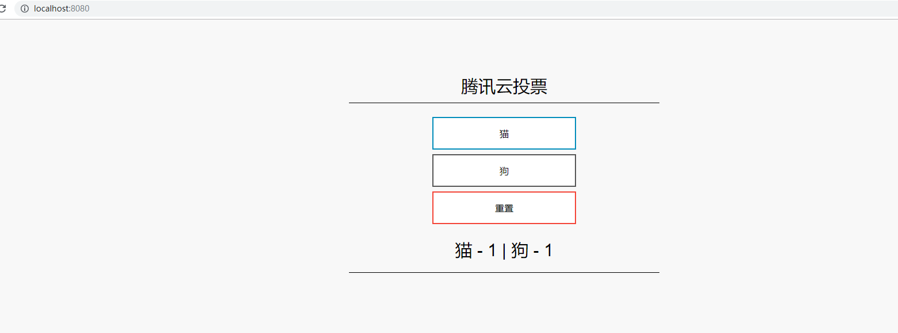

# <a name="tutorial-run-applications-in-tke-kubernetes-service"></a>在 腾讯云容器服务 (TKE) 中运行应用程序

Kubernetes 为容器化应用程序提供一个分布式平台。 你生成自己的应用程序和服务并将其部署到 Kubernetes 群集中，让群集管理可用性和连接性。 本节将把示例应用程序会部署到 Kubernetes 群集中。 学习如何：

> [!div class="checklist"]
> * 更新 Kubernetes 清单文件
> * 在 Kubernetes 中运行应用程序
> * 测试应用程序

在后续教程中，此应用程序将进行横向扩展和更新。

本教程假定你基本了解 Kubernetes 概念。有关 Kubernetes 的详细信息，请参阅 [Kubernetes 文档][kubernetes-documentation]。

## <a name="before-you-begin"></a>开始之前

在前面的教程中，我们已将应用程度打包到容器映像中，将此映像上传到 Tencent Hub的容器仓库中，并创建了 Kubernetes 群集。

必须先预创建 `qcloud-vote-all-in-one-redis.yaml` Kubernetes 清单文件，然后才能完成本教程。 此文件是在上一教程中与应用程序源代码一同下载。 验证是否已克隆代码库，并且是否已将目录更改为克隆的代码库。 如果尚未完成这些步骤，并且想要逐一完成，请返回到  创建容器映像 。 

## <a name="update-the-manifest-file"></a>更新清单文件

在这些教程中，请使用 Tencent Hub 容器仓库 实例来存储示例应用程序的容器映像。 若要部署此应用程序，必须更新 Kubernetes 清单文件中的映像名称，使之包括 Tencent Hub 登录服务器名称。

 
```

在第一个教程中克隆的 git 存储库中的示例清单文件使用仓库名称为 *hub.tencentyun.com/geffzhang*。 使用 `vi` 之类的文本编辑器打开该清单文件：

```console
vi qcloud-vote-all-in-one-redis.yaml
```

将 *hub.tencentyun.com/geffzhang* 替换为 Tencent Hub 项目名称。 映像名称位于清单文件的第 45-60 行， 同时注意imagePullSecrets 的*name:tencenthubkey* 就是Tencent Hub的镜像私有仓库的变量，是必须设置的。 以下示例展示了默认映像名称：

```yaml
      containers:
      - name: qcloud-vote-front
        image: hub.tencentyun.com/geffzhang/qcloud-vote-front:v1
        ports:
        - containerPort: 80
        resources:
          requests:
            cpu: 250m
          limits:
            cpu: 500m
        env:
        - name: REDIS
          value: "qcloud-vote-back"
      imagePullSecrets:
       - name: qcloudregistrykey
       - name: tencenthubkey
```

提供自己的 Tencent Hub的项目仓库名称，使清单文件如以下示例所示：

```yaml
containers:
- name: qcloud-vote-front
  image: hub.tencentyun.com/geffzhang/qcloud-vote-front:v1
```

保存并关闭该文件。

## <a name="deploy-the-application"></a>部署应用程序

若要部署应用程序，请使用 [kubectl apply][kubectl-apply] 命令。 此命令分析清单文件并创建定义的 Kubernetes 对象。 指定示例清单文件，如以下示例所示：

```console
kubectl apply -f qcloud-vote-all-in-one-redis.yaml
```

Kubernetes 对象在群集中创建，如以下示例所示：

```
$ kubectl apply -f qcloud-vote-all-in-one-redis.yaml

deployment.apps "qcloud-vote-back" created
service "qcloud-vote-back" created
deployment.apps "qcloud-vote-front" created
service "qcloud-vote-front" created
```

## <a name="test-the-application"></a>测试应用程序

创建向 Internet 公开应用程序的 [Kubernetes 服务][kubernetes-service]。 此过程可能需要几分钟。 若要监视进度，请将 [kubectl get service][kubectl-get] 命令与 `--watch` 参数配合使用：

```console
kubectl get service qcloud-vote-front --watch
```

以下示例显示现在已分配一个公共 IP 地址：

```
NAME                TYPE           CLUSTER-IP       EXTERNAL-IP       PORT(S)        AGE
qcloud-vote-front   LoadBalancer   172.16.255.183   193.112.254.239   80:32093/TCP   2m
```

若要查看正在操作的应用程序，请打开 Web 浏览器并转到外部 IP 地址。



如果应用程序未加载，可能是因为容器仓库存在授权问题。 若要查看容器的状态，请使用 `kubectl get pods` 命令。  

## <a name="next-steps"></a>后续步骤

在本教程中，已将 腾讯云投票应用程序部署到 TKE 中的 Kubernetes 群集。 你已了解如何：

> [!div class="checklist"]
> * 更新 Kubernetes 清单文件
> * 在 Kubernetes 中运行应用程序
> * 测试应用程序

 
<!-- LINKS - external -->
[kubectl-apply]: https://kubernetes.io/docs/reference/generated/kubectl/kubectl-commands#apply
[kubectl-create]: https://kubernetes.io/docs/reference/generated/kubectl/kubectl-commands#create
[kubectl-get]: https://kubernetes.io/docs/reference/generated/kubectl/kubectl-commands#get
[kubernetes-documentation]: https://kubernetes.io/docs/home/
[kubernetes-service]: https://kubernetes.io/docs/concepts/services-networking/service/