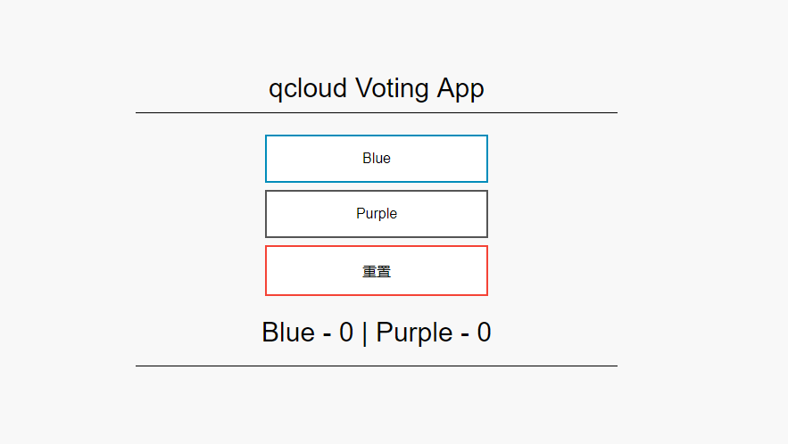

# <a name="tutorial-update-an-application-in-tke-kubernetes-service"></a> 在腾讯云容器服务 (TKE) 中更新应用程序

在 Kubernetes 中部署应用程序后，可以指定新的容器映像或映像版本，从而更新应用程序。 这样做时，更新会进行暂存，因此只有一部分部署会同时更新。 借助这种暂存更新，可以让应用程序在更新期间继续运行。 如果发生部署故障，还可以利用它的回滚机制。

在本教程，我们便完成了对 腾讯云投票 应用示例的更新。 学习如何：

> [!div class="checklist"]
> * 更新前端应用程序代码
> * 创建更新的容器映像
> * 向 Azure 容器注册表推送容器映像
> * 部署更新的容器映像

## <a name="before-you-begin"></a>开始之前

在前面的教程中，已将应用程度打包到容器映像中，将该映像上传到 Tencent Hub 容器仓库，并创建了 Kubernetes 群集。 应用程序随后在 Kubernetes 群集上运行。

还克隆了应用程序存储库，其中包括应用程序源代码和本教程中使用的预创建的 Docker Compose 文件。 验证是否已克隆存储库，并且是否已将目录更改为克隆的目录。 如果尚未完成这些步骤，并且想要逐一完成，请返回到 创建容器映像。


## <a name="update-an-application"></a>更新应用程序

让我们更改示例应用程序，然后更新已部署到 TKE 群集的版本。 示例应用程序源代码位于 *qcloud-vote* 目录中。 使用编辑器（例如 `vi`）打开 *config_file.cfg* 文件：

```console
vi qcloud-vote/qcloud-vote/config_file.cfg
```

将 *VOTE1VALUE* 和 *VOTE2VALUE* 的值更改为不同的颜色。 以下示例显示更新的颜色值：

```
# UI Configurations
TITLE = 'qcloud Voting App'
VOTE1VALUE = 'Blue'
VOTE2VALUE = 'Purple'
SHOWHOST = 'false'
```

保存并关闭该文件。

## <a name="update-the-container-image"></a>更新容器映像

若要重新创建前端映像并测试更新的应用程序，请使用 [docker-compose][docker-compose]。 `--build` 参数用于指示 Docker Compose 重新创建应用程序映像：

```console
docker-compose up --build -d
```

## <a name="test-the-application-locally"></a>在本地测试应用程序

若要验证已更新的容器映像是否显示所做的更改，请打开一个本地 Web 浏览器并访问 http://localhost:8080。



在 *config_file.cfg* 文件中提供的已更新颜色值显示在正运行的应用程序上。

## <a name="tag-and-push-the-image"></a>标记并推送映像


使用 [docker tag][docker-tag] 标记映像。 将 `hub.tencentyun.com/geffzhang/qcloud-vote-front` 替换为  Tencent Hub 项目名称，并将映像版本更新为 *:v2*，如下所示：

```console
docker tag qcloud-vote-front hub.tencentyun.com/geffzhang/qcloud-vote-front:v2
```

现在，请使用 [docker push][docker-push] 将映像上传到注册表。 将 `hub.tencentyun.com/geffzhang/qcloud-vote-front` 替换为 Tencent Hub 项目名称。 

```console
docker push hub.tencentyun.com/geffzhang/qcloud-vote-front:v2
```

## <a name="deploy-the-updated-application"></a>部署更新的应用程序

为了确保最长运行时间，必须运行应用程序 Pod 的多个实例。 使用 [kubectl get pods][kubectl-get] 命令验证运行的前端实例的数目：

```
$ kubectl get pods

NNAME                                 READY     STATUS    RESTARTS   AGE
qcloud-vote-back-b68b85dbf-cn9lz     1/1       Running   0          44m
qcloud-vote-front-76fccf8655-5qrvt   1/1       Running   0          29m
qcloud-vote-front-76fccf8655-5t9vh   1/1       Running   0          44m
```

如果没有多个前端 Pod，请缩放 *qcloud-vote-front* 部署，如下所示：

```console
kubectl scale --replicas=2 deployment/qcloud-vote-front
```

若要更新应用程序，请使用 [kubectl set][kubectl-set] 命令。 使用Tencent Hub项目名称更新 `hub.tencentyun.com/geffzhang/qcloud-vote-front`，并指定 *v2* 应用程序版本：

```console
kubectl set image deployment qcloud-vote-front hub.tencentyun.com/geffzhang/qcloud-vote-front:v2
```

若要监视部署，请使用 [kubectl get pod][kubectl-get] 命令。 部署更新的应用程序时，Pod 终止运行并通过新容器映像重新创建。

```console
kubectl get pods
```

以下示例输出显示，在部署进行时，Pod 正在终止，新实例正在运行：

```
$ kubectl get pods

NAME                               READY     STATUS        RESTARTS   AGE
NAME                                 READY     STATUS    RESTARTS   AGE
qcloud-vote-back-b68b85dbf-cn9lz     1/1       Running   0          44m
qcloud-vote-front-76fccf8655-5qrvt   1/1       Running   0          29m
qcloud-vote-front-76fccf8655-5t9vh   1/1       Running   0          44m
```

## <a name="test-the-updated-application"></a>测试更新的应用程序

若要查看更新的应用程序，请先获取 `qcloud-vote-front` 服务的外部 IP 地址：

```console
kubectl get service qcloud-vote-front
```

现在，请打开本地 Web 浏览器并访问该 IP 地址。


## <a name="next-steps"></a>后续步骤

在本教程中，更新了应用程序并向 Kubernetes 群集推出了此更新。 你已了解如何：

> [!div class="checklist"]
> * 更新前端应用程序代码
> * 创建更新的容器映像
> * 向Tencent Hub 容器仓库推送容器映像
> * 部署更新的容器映像
 

<!-- LINKS - external -->
[docker-compose]: https://docs.docker.com/compose/
[docker-push]: https://docs.docker.com/engine/reference/commandline/push/
[docker-tag]: https://docs.docker.com/engine/reference/commandline/tag/
[kubectl-get]: https://kubernetes.io/docs/reference/generated/kubectl/kubectl-commands#get
[kubectl-set]: https://kubernetes.io/docs/reference/generated/kubectl/kubectl-commands#set
